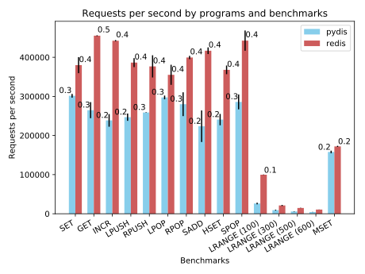

# pydis
**pydis** is an experiment to disprove some of the falsehoods about performance
and optimisation regarding software and interpreted languages in particular.

Unfortunately many programmers, due to their lack of experience, of some
knowledge of computer architecture(s), or of an in-depth understanding of the
task they are given, spend countless hours by making life harder for themselves
in the name of marginal performance gains, often trading many other conveniences
(such as type safety, garbage collection, *etc*) too.

Below you will find a [Redis](https://github.com/antirez/redis/) clone,
**pydis**, written *in < 250 lines of idiomatic Python code*, providing a
subset of redis' functionality for which there are
[official benchmarks](https://redis.io/topics/benchmarks).

Briefly, **pydis** is ~60% as fast as Redis measured in number operations per
second.

P.S. This is not a criticism of Redis, which is a brilliant project and a 
system-level software that powers thousands of infrastructures. It just happened
to be one of the fastest software I could imagine *and* clone the same day.

## Results
```bash
redis-benchmark -q -t set,get,incr,lpush,rpush,lpop,rpop,sadd,hset,spop,lrange,mset -n 100000 -P 5 
```

  - 100,000 requests in total per command.
  - Requests are pipelined in groups of 5.

<center>
  
</center>

Benchmark | pydis | redis | Ratio
--- | ---: | ---: | ---
SET | 301,582 | 379,944 | 0.794
GET | 264,841 | 455,237 | 0.582
INCR | 238,670 | 442,483 | 0.539
LPUSH | 246,867 | 386,442 | 0.639
RPUSH | 258,845 | 376,787 | 0.687
LPOP | 297,397 | 355,276 | 0.837
RPOP | 280,095 | 399,511 | 0.701
SADD | 223,700 | 416,842 | 0.537
HSET | 240,649 | 367,985 | 0.654
SPOP | 285,936 | 442,747 | 0.646
LRANGE (100) | 26,162 | 99,703 | 0.262
LRANGE (300) | 9,135 | 21,211 | 0.431
LRANGE (500) | 5,788 | 14,649 | 0.395
LRANGE (600) | 4,339 | 10,659 | 0.407
MSET | 157,963 | 172,226 | 0.917

### Host System
- Ubuntu 18.04
- Python 3.6.7 (GCC 8.2.0)
- Redis 4.0.9 `malloc=jemalloc-3.6.0 bits=64 build=76095d16786fbcba`

## Contributions
Contributions are very welcome, given that they fall into one of the following
categories:

- Those that improve the performance.
  - The aim of this exercise is to prove that interpreted languages can be just
    as fast as C. So whilst using a faster parser in C with Python bindings is
    okay, rewriting **pydis** in [Cython](https://cython.org/) is not.
  - I will accept "minor" deviations from idioms only if the performance gains
    are worth it; stick to idiomatic Python otherwise!
- Those to achieve feature parity with Redis *for which there are official
  benchmarks*.
  - We are not trying to develop a full-featured Redis clone here so please do 
    not implement commands for which there are no official benchmarks.
- Those that fix formatting etc.
  - Please do not invent your own style, use PEP 8.
